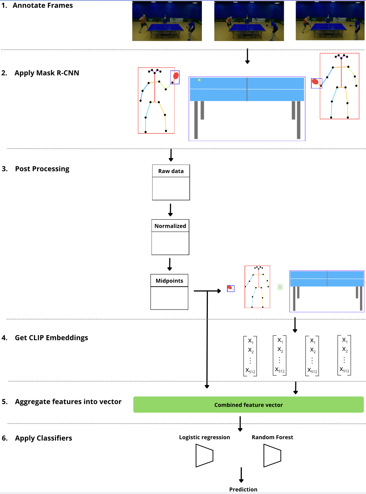

# Racket sport stroke identification



## Project Structure

- **folder structure**:

```plaintext
.
├── LICENSE
├── README.md
├── __pycache__
│   └── utility_functions.cpython-311.pyc
├── clip_captions.json
├── cropped
│   ├── video_1
│   ├── video_1m
│   ├── video_2
│   ├── video_2m
│   ├── video_3
│   └── video_3m
├── data
│   ├── events
│   ├── splits
│   ├── splits_old
│   ├── video_1
│   ├── video_2
│   └── video_3
├── embeddings
│   ├── text
│   ├── video_1
│   ├── video_1m
│   ├── video_2
│   ├── video_2m
│   ├── video_3
│   └── video_3m
├── figures
│   ├── t-snes
│   └── umaps
├── notebooks
│   ├── cropped
│   ├── empty_event_keys.json
│   ├── empty_event_keys2.json
│   ├── empty_event_keys_1_frame.json
│   ├── extract_frames.ipynb
│   ├── low_qual.ipynb
│   └── show_crops.ipynb
├── pyproject.toml
├── requirements.txt
├── src
│   ├── annotation
│   │   └── annotate.py
│   ├── augement
│   │   ├── demo.py
│   │   └── mirror_keypoints.py
│   ├── classification
│   │   ├── data_split.py
│   │   ├── data_split_oversampling.py
│   │   ├── log_reg.py
│   │   └── log_reg_better.py
│   ├── clip
│   │   ├── crop_objects.py
│   │   ├── crop_people.py
│   │   ├── extract_image_embeddings.py
│   │   ├── extract_text_embeddings.py
│   │   └── read_embedding.py
│   ├── data_utils
│   │   └── dataloader.py
│   ├── dectectron2.py
│   ├── extract_hits.py
│   ├── plotting
│   │   ├── dbscan.py
│   │   ├── distance_plot.py
│   │   ├── joint_dbscan.py
│   │   ├── joint_time_dbscan.py
│   │   ├── nn.py
│   │   ├── pca_plot.py
│   │   ├── scatter_plot.py
│   │   ├── t-sne.py
│   │   └── umap_plotting.py
│   ├── post_processing
│   │   ├── combine_tables.py
│   │   ├── distance_to_midtpoints.py
│   │   ├── midpoints.py
│   │   └── normalize.py
│   └── verify.py
├── utility_functions.py
└── videos
    ├── game_1.mp4
    ├── game_1f.mp4
    ├── game_2.mp4
    ├── game_2f.mp4
    ├── game_3.mp4
    └── game_3f.mp4
```

# Annotating Data
The annotate.py file located in the src/annotation directory, enables annotations of frames that are labelled with a specific value. This value is currently set to **empty_event** in the **label_of_interest** field at the top of the script.

1. Start by adding the video you want to annotate to the **videos** folder.  
2. Then add a json file with the frames you wish to annotate with frames as keys and **empty_event** as value.  
   Example:  
   
    ```json
    {
      "123": "empty_event",
      "456": "empty_event"
    }
    ```

   The json can include other key-value pairs but these will be ignored.  
3. Specify the path to the video and json file at the top of the `annotate.py` script.  
4. Run the script.


The script will show you the frames you have specified in the json file, and request the label in the terminal. Predefined codes has been specified to speed the process up. These codes are currently just short hand notation, for example **lbl** is short for **left_backhand_loop**.

To leave a label as is, simply leave the prompt empty and press 'enter'.

The labels will be updated as soon as the script is prompted with the new label.

To check other labels, simply change the **label_of_interest** field.

# Extracting data from a video


# Training a model


## Order of Execution
1. Get keypoints
2. Combine the tables
3. Normalize
4. Find midpoints. Can also find mirrored


### Third Party Dependencies and licenses

- **CLIP**:
- **Detectron2**:

## Authors and Acknowledgment

This project was started by **Moamal Fadhil Abdul-Mahdi**.